#  Дипломная работа по профессии «Системный администратор» - Кузьминцев Илья

Содержание
==========
* [Задача](#Задача)
* [Инфраструктура](#Инфраструктура)
    * [Сайт](#Сайт)
    * [Мониторинг](#Мониторинг)
    * [Логи](#Логи)
    * [Сеть](#Сеть)
    * [Резервное копирование](#Резервное-копирование)
    * [Дополнительно](#Дополнительно)
* [Выполнение работы](#Выполнение-работы)
* [Критерии сдачи](#Критерии-сдачи)
* [Как правильно задавать вопросы дипломному руководителю](#Как-правильно-задавать-вопросы-дипломному-руководителю) 

---------

## Задача
Ключевая задача — разработать отказоустойчивую инфраструктуру для сайта, включающую мониторинг, сбор логов и резервное копирование основных данных. Инфраструктура должна размещаться в [Yandex Cloud](https://cloud.yandex.com/) и отвечать минимальным стандартам безопасности: запрещается выкладывать токен от облака в git. Используйте [инструкцию](https://cloud.yandex.ru/docs/tutorials/infrastructure-management/terraform-quickstart#get-credentials).

**Перед началом работы над дипломным заданием изучите [Инструкция по экономии облачных ресурсов](https://github.com/netology-code/devops-materials/blob/master/cloudwork.MD).**

## Инфраструктура
Для развёртки инфраструктуры используйте Terraform и Ansible.  

Не используйте для ansible inventory ip-адреса! Вместо этого используйте fqdn имена виртуальных машин в зоне ".ru-central1.internal". Пример: example.ru-central1.internal  - для этого достаточно при создании ВМ указать name=example, hostname=examle !! 

Важно: используйте по-возможности **минимальные конфигурации ВМ**:2 ядра 20% Intel ice lake, 2-4Гб памяти, 10hdd, прерываемая. 

**Так как прерываемая ВМ проработает не больше 24ч, перед сдачей работы на проверку дипломному руководителю сделайте ваши ВМ постоянно работающими.**

Ознакомьтесь со всеми пунктами из этой секции, не беритесь сразу выполнять задание, не дочитав до конца. Пункты взаимосвязаны и могут влиять друг на друга.

### Сайт
Создайте две ВМ в разных зонах, установите на них сервер nginx, если его там нет. ОС и содержимое ВМ должно быть идентичным, это будут наши веб-сервера.

Используйте набор статичных файлов для сайта. Можно переиспользовать сайт из домашнего задания.

Виртуальные машины не должны обладать внешним Ip-адресом, те находится во внутренней сети. Доступ к ВМ по ssh через бастион-сервер. Доступ к web-порту ВМ через балансировщик yandex cloud.

Настройка балансировщика:

1. Создайте [Target Group](https://cloud.yandex.com/docs/application-load-balancer/concepts/target-group), включите в неё две созданных ВМ.

2. Создайте [Backend Group](https://cloud.yandex.com/docs/application-load-balancer/concepts/backend-group), настройте backends на target group, ранее созданную. Настройте healthcheck на корень (/) и порт 80, протокол HTTP.

3. Создайте [HTTP router](https://cloud.yandex.com/docs/application-load-balancer/concepts/http-router). Путь укажите — /, backend group — созданную ранее.

4. Создайте [Application load balancer](https://cloud.yandex.com/en/docs/application-load-balancer/) для распределения трафика на веб-сервера, созданные ранее. Укажите HTTP router, созданный ранее, задайте listener тип auto, порт 80.

Протестируйте сайт
`curl -v <публичный IP балансера>:80` 

### Мониторинг
Создайте ВМ, разверните на ней Zabbix. На каждую ВМ установите Zabbix Agent, настройте агенты на отправление метрик в Zabbix. 

Настройте дешборды с отображением метрик, минимальный набор — по принципу USE (Utilization, Saturation, Errors) для CPU, RAM, диски, сеть, http запросов к веб-серверам. Добавьте необходимые tresholds на соответствующие графики.

### Логи
Cоздайте ВМ, разверните на ней Elasticsearch. Установите filebeat в ВМ к веб-серверам, настройте на отправку access.log, error.log nginx в Elasticsearch.

Создайте ВМ, разверните на ней Kibana, сконфигурируйте соединение с Elasticsearch.

### Сеть
Разверните один VPC. Сервера web, Elasticsearch поместите в приватные подсети. Сервера Zabbix, Kibana, application load balancer определите в публичную подсеть.

Настройте [Security Groups](https://cloud.yandex.com/docs/vpc/concepts/security-groups) соответствующих сервисов на входящий трафик только к нужным портам.

Настройте ВМ с публичным адресом, в которой будет открыт только один порт — ssh.  Эта вм будет реализовывать концепцию  [bastion host]( https://cloud.yandex.ru/docs/tutorials/routing/bastion) . Синоним "bastion host" - "Jump host". Подключение  ansible к серверам web и Elasticsearch через данный bastion host можно сделать с помощью  [ProxyCommand](https://docs.ansible.com/ansible/latest/network/user_guide/network_debug_troubleshooting.html#network-delegate-to-vs-proxycommand) . Допускается установка и запуск ansible непосредственно на bastion host.(Этот вариант легче в настройке)

Исходящий доступ в интернет для ВМ внутреннего контура через [NAT-шлюз](https://yandex.cloud/ru/docs/vpc/operations/create-nat-gateway).

### Резервное копирование
Создайте snapshot дисков всех ВМ. Ограничьте время жизни snaphot в неделю. Сами snaphot настройте на ежедневное копирование.

### Дополнительно
Не входит в минимальные требования. 

1. Для Zabbix можно реализовать разделение компонент - frontend, server, database. Frontend отдельной ВМ поместите в публичную подсеть, назначте публичный IP. Server поместите в приватную подсеть, настройте security group на разрешение трафика между frontend и server. Для Database используйте [Yandex Managed Service for PostgreSQL](https://cloud.yandex.com/en-ru/services/managed-postgresql). Разверните кластер из двух нод с автоматическим failover.
2. Вместо конкретных ВМ, которые входят в target group, можно создать [Instance Group](https://cloud.yandex.com/en/docs/compute/concepts/instance-groups/), для которой настройте следующие правила автоматического горизонтального масштабирования: минимальное количество ВМ на зону — 1, максимальный размер группы — 3.
3. В Elasticsearch добавьте мониторинг логов самого себя, Kibana, Zabbix, через filebeat. Можно использовать logstash тоже.
4. Воспользуйтесь Yandex Certificate Manager, выпустите сертификат для сайта, если есть доменное имя. Перенастройте работу балансера на HTTPS, при этом нацелен он будет на HTTP веб-серверов.

## Выполнение работы
На этом этапе вы непосредственно выполняете работу. При этом вы можете консультироваться с руководителем по поводу вопросов, требующих уточнения.

⚠️ В случае недоступности ресурсов Elastic для скачивания рекомендуется разворачивать сервисы с помощью docker контейнеров, основанных на официальных образах.

**Важно**: Ещё можно задавать вопросы по поводу того, как реализовать ту или иную функциональность. И руководитель определяет, правильно вы её реализовали или нет. Любые вопросы, которые не освещены в этом документе, стоит уточнять у руководителя. Если его требования и указания расходятся с указанными в этом документе, то приоритетны требования и указания руководителя.

## Критерии сдачи
1. Инфраструктура отвечает минимальным требованиям, описанным в [Задаче](#Задача).
2. Предоставлен доступ ко всем ресурсам, у которых предполагается веб-страница (сайт, Kibana, Zabbix).
3. Для ресурсов, к которым предоставить доступ проблематично, предоставлены скриншоты, команды, stdout, stderr, подтверждающие работу ресурса.
4. Работа оформлена в отдельном репозитории в GitHub или в [Google Docs](https://docs.google.com/), разрешён доступ по ссылке. 
5. Код размещён в репозитории в GitHub.
6. Работа оформлена так, чтобы были понятны ваши решения и компромиссы. 
7. Если использованы дополнительные репозитории, доступ к ним открыт. 

## Как правильно задавать вопросы дипломному руководителю
Что поможет решить большинство частых проблем:
1. Попробовать найти ответ сначала самостоятельно в интернете или в материалах курса и только после этого спрашивать у дипломного руководителя. Навык поиска ответов пригодится вам в профессиональной деятельности.
2. Если вопросов больше одного, присылайте их в виде нумерованного списка. Так дипломному руководителю будет проще отвечать на каждый из них.
3. При необходимости прикрепите к вопросу скриншоты и стрелочкой покажите, где не получается. Программу для этого можно скачать [здесь](https://app.prntscr.com/ru/).

Что может стать источником проблем:
1. Вопросы вида «Ничего не работает. Не запускается. Всё сломалось». Дипломный руководитель не сможет ответить на такой вопрос без дополнительных уточнений. Цените своё время и время других.
2. Откладывание выполнения дипломной работы на последний момент.
3. Ожидание моментального ответа на свой вопрос. Дипломные руководители — работающие инженеры, которые занимаются, кроме преподавания, своими проектами. Их время ограничено, поэтому постарайтесь задавать правильные вопросы, чтобы получать быстрые ответы 

---

# Ход дипломной работы

## Подготовительные работы

- Утилита `yc` (Yandex Cloud CLI) настроена и авторизована
- Подготовка сервисного аккаунта и получение .json ключа
- Terraform 
- Ansible 
- SSH-ключ `~/.ssh/id_ed25519` 
- Создание .gitignore

## Terraform

Создаём файлы Terraform, у меня их получилось 7 и один .yml файл содержащий авторизационные данные: 

[main.tf](./terraform/main.tf)
[variables.tf](./terraform/variables.tf)
[cloud-init.yml](./terraform/cloud-init.yml)
[network.tf](./terraform/network.tf.tf)
[security_groups.tf](./terraform/security_groups.tf)
[instance.tf](./terraform/instance.tf)
[snapshots.tf](./terraform/snapshots.tf)
[output.tf](./terraform/output.tf)

После создания, поднимать инфраструктуру в YC с помощью команды 'terraform apply'

Получили вывод: 

```

Apply complete! Resources: 28 added, 0 changed, 0 destroyed.

Outputs:

bastion_public_ip = "93.77.191.248"
elastic_private_ip = "10.10.11.30"
kibana_public_ip = "46.21.246.49"
web1_private_ip = "10.10.11.6"
web2_private_ip = "10.10.12.12"
web_lb_public_ip = "111.88.243.94"
zabbix_public_ip = "46.21.246.72"

```
Вывод был сделан для личного удобства, для работы в ansible согласно заданию по fqdn именам, создаётся автоматически файл hosts.ini и перемещается в ./ansible

## Инстансы

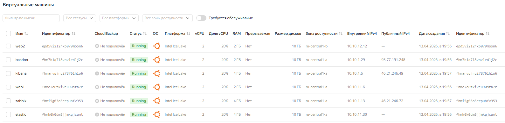

## Группы безопасности

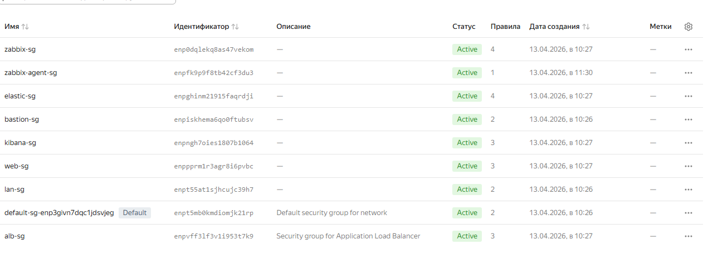

## ALB Rules

**Target Group**

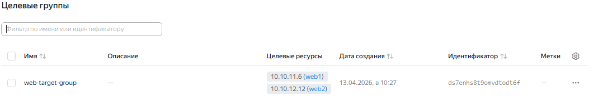

**Backend Group**

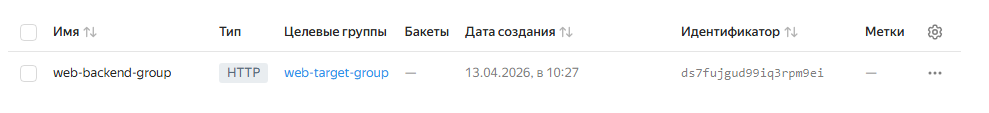

**HTTP router** 

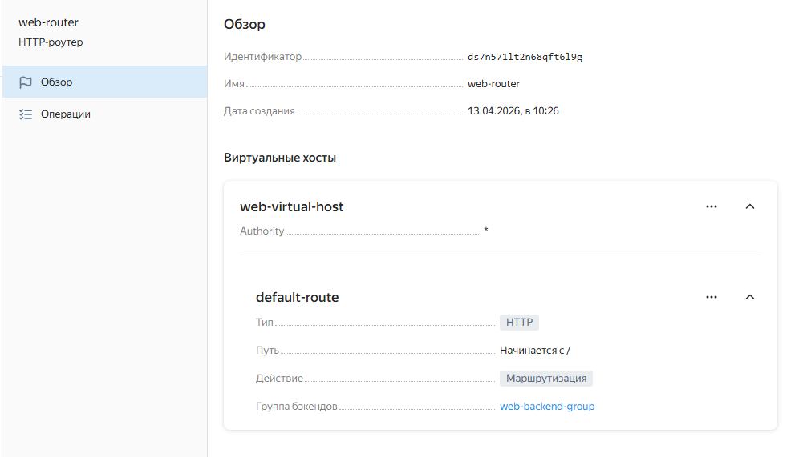

**Application Load Balancer**

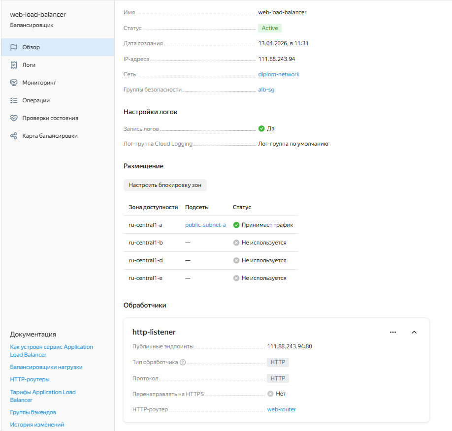

## Резервное копирование


snapshots.tf

```

resource "yandex_compute_snapshot_schedule" "daily_backup_all" {
  name        = "daily-backup-all-servers"
  description = "Daily snapshots of all servers"

  schedule_policy {
    expression = "0 3 * * *"  
  }

  retention_period = "168h"  

  snapshot_spec {
    description = "Daily automated backup"
  }

  # Все сервера из inventory
  disk_ids = [
    yandex_compute_instance.bastion.boot_disk[0].disk_id,
    yandex_compute_instance.web1.boot_disk[0].disk_id,
    yandex_compute_instance.web2.boot_disk[0].disk_id,
    yandex_compute_instance.elastic.boot_disk[0].disk_id,
    yandex_compute_instance.zabbix.boot_disk[0].disk_id,
    yandex_compute_instance.kibana.boot_disk[0].disk_id,
  ]
}

```

## Ansible

### Подготовка Playbook's

Создаём файлы Ansible, у меня их получилось 5 .yml, 1 файл .ini и файл конфигураци: 

[ansible.cfg](./ansible/ansible.cfg)
[hosts.ini](./ansible/hosts.ini)
[elastic.yml](./ansible/elastic.yml)
[filebeat.yml](./ansible/filebeat.ini)
[kibana.yml](./ansible/kibana.ini)
[nginx.yml](./ansible/nginx.ini)
[zabbix.yml](./ansible/zabbix.ini)

После создания, проверяем доступность эндпоинтов с помощью команды 'ansible all -m ping'

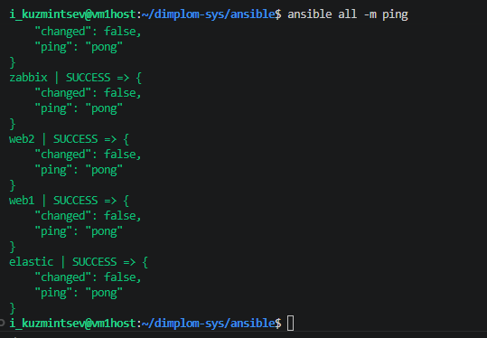

## Установка Playbook's

### zabbix server + zabbix agent

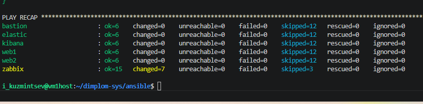

Переходим на http://46.21.246.72/zabbix

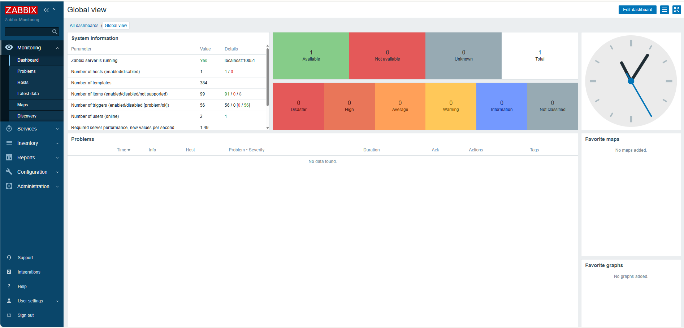

Добавляем эндпоинты по dns, присваиваем группы

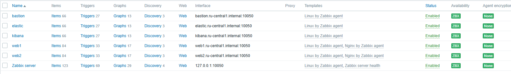

Создаём dashboards и триггеры

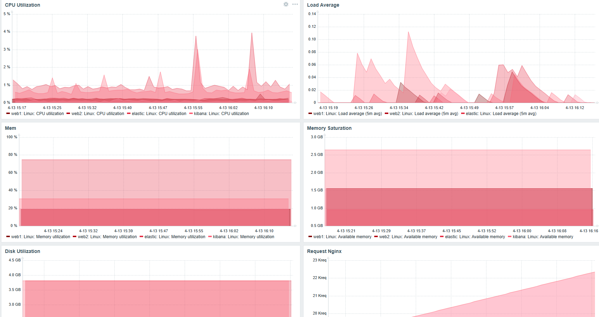


### Nginx

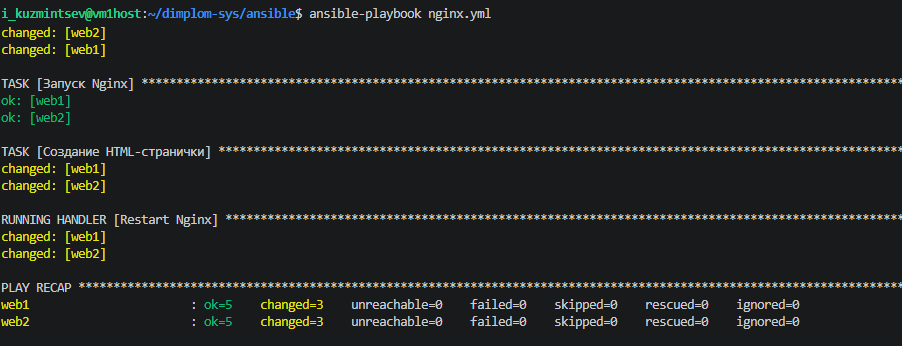

**Проверям**

Переходим по IP балансировщика http://111.88.243.94/

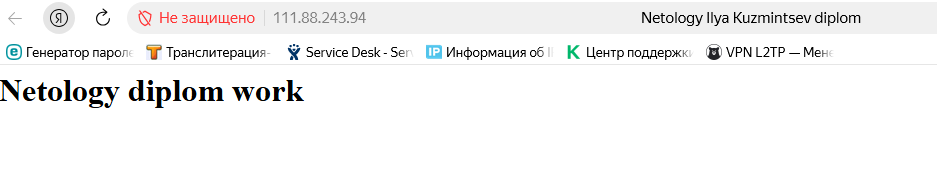

Сделай несколько запросов для проверки, ip меняется

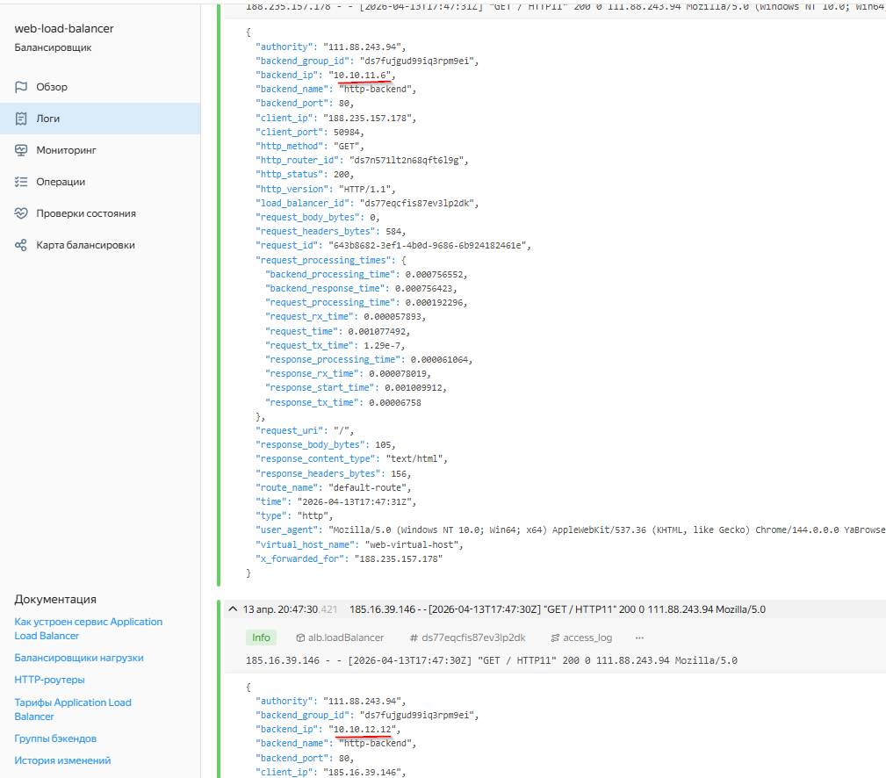

### ELK

**Elasticsearch**

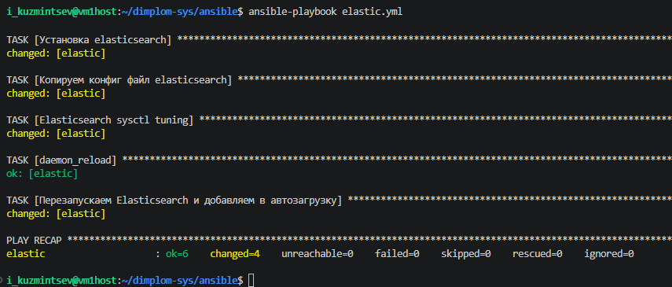

**Kibana**

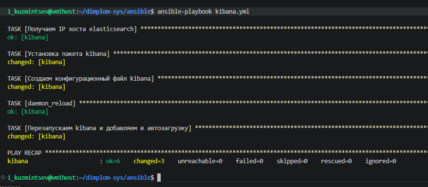

**Filebeat**

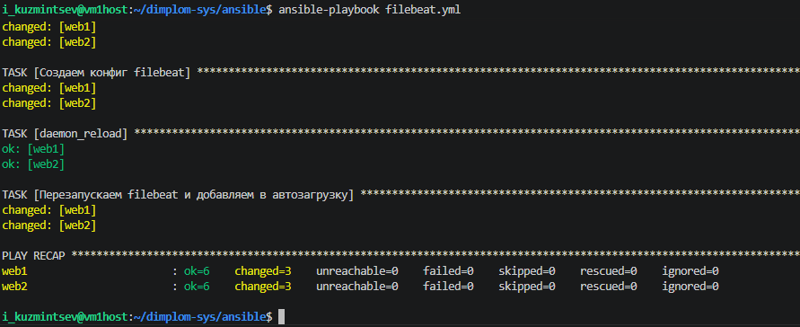

Переходим на http://46.21.246.49:5601 для настройки Kibana(сбор логов)

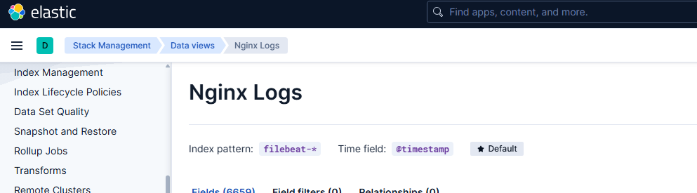

Проверим логи в Discover

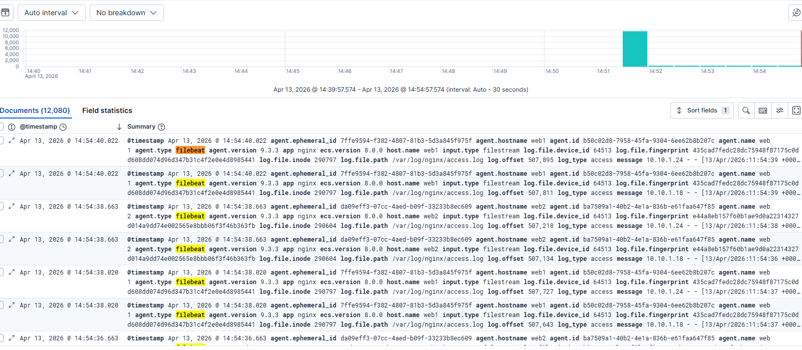

### .gitignore

Создаём файл 

```

**/terraform/variables.tf
**/terraform/terraform.tfstate
**/terraform/terraform.tfstate.backup
**/terraform/cloud-init.yml
**/terraform/.terraform.lock.hcl
**/terraform/authorized_key.json

```


## Ссылки

[Nginx](http://111.88.243.94/)
[Kibana](http://46.21.246.49:5601)
[Zabbix](http://46.21.246.72/zabbix)


---


